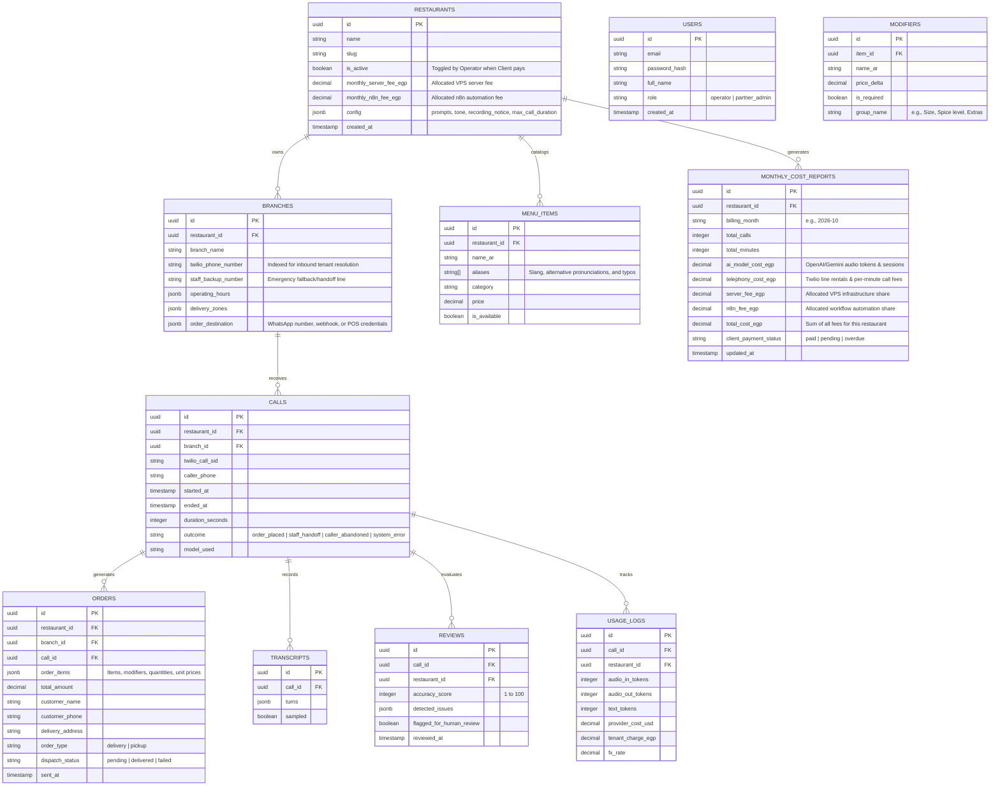

# Project Plan: Multi-Tenant Egyptian-Arabic AI Voice Assistant for Restaurants (B2B SaaS)

> **Instructions to the AI reading this:** You are the lead platform engineer for this project. This product is a **multi-tenant B2B SaaS platform** built to be marketed and sold to **multiple independent restaurant brands and chains**. Work phase by phase, in order. At the start of each phase, restate what you are about to build, list missing inputs, and **ask rather than invent** (tenant configurations, menus, telephony details, API keys). Verify every API detail (model names, event names, parameters) against **current official documentation**. Every component must support multi-tenancy: strict tenant isolation, dynamic routing by phone number, configurable restaurant personas/menus, and per-client usage tracking & billing.

---

## 1. Product Vision & Goal

Build and operate a multi-tenant voice AI platform that serves **multiple restaurant clients** across Egypt and the MENA region. 

For each subscribed restaurant, the system:
1. Answers customer phone calls in natural **Egyptian Arabic dialect**.
2. Understands customer intent, takes orders from that restaurant's specific dynamic menu, manages modifiers, and confirms customer details (delivery address/pickup).
3. Delivers confirmed orders instantly to that specific restaurant's destination (WhatsApp Business number, POS, or cashier system).
4. Provides seamless human escalation to branch staff when needed.
5. Logs every call, records metrics, runs automated QA audits, and generates **client-ready daily/monthly usage and billing reports**.

### Business & Operational Model (1-to-1 Partner Relationship)
- **Product Type:** B2B Managed Voice AI Platform & Reseller Solution.
- **Stakeholders & Roles:**
  1. **Platform Operator (You / Ahmed):**
     - Manages the core backend infrastructure (VPS, Twilio, OpenAI Realtime, FastAPI, PostgreSQL, n8n).
     - Deals **1-to-1** with the **Client (Operations Partner / Agency)**.
     - Operates the **Master Operator Control Panel (`/operator`)** to add or remove restaurants, assign telephony numbers, and toggle restaurant access (`active` vs. `disabled`) as agreed when the client settles platform fees.
     - **Full Operator Report Visibility & Automated Delivery:**
       - All operational, financial, and audio reports reach the Operator directly.
       - Operator dashboard and automated n8n notifications (WhatsApp/Email) deliver itemized cost reports: **AI Model Fees**, **Telephony Fees**, **Allocated Server Fees**, and **n8n Automation Fees** per restaurant, as well as call recordings, synced transcripts, live order feeds, and client payment tracking.
  2. **The Client (Operations Partner / Agency):**
     - Directly reaches, acquires, and manages relationships with restaurant brands.
     - Collects payments directly from individual restaurants.
     - Operates a dedicated **Client Admin & Reports Portal (`/reports`)** to:
       - Monitor live call logs, audio recordings, order fulfillment, and accuracy metrics.
       - Track itemized monthly cost reports for each restaurant: **AI model fees**, **Twilio telephony fees**, **allocated server fees**, and **n8n automation fees**.
       - Track and record payment collection status from each restaurant.
  3. **Restaurants (Tenants):**
     - End restaurant brands and branches whose phone calls are answered in Egyptian Arabic dialect and dispatched to their kitchen/cashier.
- **Onboarding & Service Control:** 
  - Adding or removing restaurants is done via the Operator Control Panel or CLI without modifying code.
  - When the client pays for a restaurant's onboarding or monthly service, the Operator enables the restaurant on the platform. If unpaid, the Operator toggles the restaurant to `disabled`, which automatically routes incoming calls directly to the restaurant's backup human staff number.
- **Non-goals for MVP:** Public online credit card checkouts, outbound telemarketing, rider dispatch.

---

## 2. Success Criteria

| Metric | Target | Notes |
|---|---|---|
| **Multi-Tenant Isolation** | 100% | Zero data leakage or cross-talk between restaurant tenants |
| **Order Accuracy** | ≥ 95% on test calls | Correct items, quantities, required modifiers, address |
| **Autonomous Resolution** | ≥ 70% | Calls completed without human staff intervention |
| **Response Latency** | < 1.5 s typical | Turn-around time from caller silence to speech response |
| **New Tenant Onboarding Time** | < 30 minutes | From receiving menu/numbers to live test call |
| **Cost & Fee Auditability** | 100% itemized | Exact AI, telephony, server, and n8n cost attribution per restaurant |
| **Wrong-Order Rate** | < 2% of total orders | Flagged and reported via automated post-call review |

---

## 3. Multi-Tenant Architecture & Call Flow

```
[ Customer Calling Restaurant A ]         [ Customer Calling Restaurant B ]
               │                                         │
               ▼                                         ▼
   Restaurant A Public Number                Restaurant B Public Number
               │ (Call Forwarding)                       │ (Call Forwarding)
               ▼                                         ▼
    Twilio Number A (Tenant A)                Twilio Number B (Tenant B)
               │                                         │
               └────────────────────┬────────────────────┘
                                    │
                                    ▼
                         Twilio Programmable Voice
                         (Media Streams WebSocket)
                                    │
                                    ▼
                 Multi-Tenant Voice Gateway (FastAPI)
      ┌──────────────────────────────────────────────────────────┐
      │ 1. Dynamic Tenant Resolution (Called Number -> Tenant)   │
      │ 2. Operator Service Gate (Is restaurant active & paid?)  │
      │ 3. Hydrate Tenant Context (Menu, Prompts, Branch Staff)  │
      │ 4. Voice AI Session (OpenAI Realtime / Gemini Live / Qwen)│
      │ 5. Scoped Tools (Tenant-isolated menu search & cart)     │
      └──────────────┬────────────────────────────┬──────────────┘
                     │                            │
                     ▼                            ▼
       PostgreSQL (Multi-Tenant DB)      Tenant Webhook / n8n
     - restaurants & branches             ├─► WhatsApp (Restaurant A/B)
     - menu_items & modifiers             ├─► Cashier / POS API
     - calls, orders & transcripts        ├─► Automated Call QA Review
     - per-restaurant itemized fees       └─► Daily & Monthly Partner Cost Reports
       (AI + Telephony + Server + n8n)
```

### Dynamic Tenant Resolution & Service Gating Flow
1. **Inbound Call:** Twilio sends a webhook request to `/voice` with `Called` (the dialed Twilio number) and `From` (customer's caller ID).
2. **Tenant & Branch Lookup:** The gateway queries PostgreSQL to resolve which `restaurant_id` and `branch_id` own the dialed number.
3. **Operator Service Gate:**
   - The gateway verifies `restaurant.is_active`:
     - **Active (Client paid / Approved):** Proceeds to initialize the AI voice assistant session.
     - **Disabled (Unpaid / Suspended by Operator):** Bypasses AI voice model. Returns TwiML `<Dial>` forwarding directly to the branch's human staff backup line so the restaurant's callers are never dropped.
4. **Session Hydration (if Active):** The gateway initializes the session with:
   - The restaurant's customized Egyptian dialect system prompt and rules (tone, brand name, recording disclaimer).
   - The restaurant's branch operational rules (delivery radius, working hours, minimum order).
   - Tool bindings scoped strictly to `restaurant_id` (so `get_menu` and `add_item` only access that restaurant's inventory).
5. **Failsafe Redirection:** If the gateway is down or errors, Twilio's fallback action immediately redirects the call to that specific branch's emergency staff phone number.

### Dual Portals Architecture (Operator Control vs. Client Reporting)
The platform provides two focused, role-based web dashboards with shared visibility into operational and cost accounting reports:

```
                                  Platform Access
                                         │
                 ┌───────────────────────┴───────────────────────┐
                 ▼                                               ▼
   Master Operator Panel (/operator)               Client Reports Portal (/reports)
    [ Role: Platform Owner / Ahmed ]                [ Role: Client / Reseller Partner ]
  ├─► Add / Remove / Edit Restaurants             ├─► Live Performance & Order Analytics
  ├─► Service Status Toggle (Active vs Disabled)  ├─► Audio Playback & Synced Transcripts
  │   (Controlled 1-to-1 based on client payment) ├─► Per-Restaurant Monthly Fee Breakdown:
  ├─► Assign Twilio Numbers & Fallback Lines      │   • AI Model Fees (Tokens & Minutes in EGP)
  ├─► Global Infrastructure & VPS Health          │   • Telephony Line Fees (Twilio minutes)
  ├─► Full Access to ALL Restaurant Reports       │   • Allocated Server Hosting Fees (VPS)
  │   (AI, Telephony, Server, and n8n fees)       │   • n8n Automation Fees
  ├─► Monitor Restaurant Payment Status           │   • Total Monthly Cost per Restaurant
  └─► Automated Digest to Operator                ├─► Track Restaurant Payment Status (Paid/Pending)
      (WhatsApp/Email Daily & Monthly Summaries)  └─► Real-Time Menu Item Availability Toggle
```


### High-Concurrency & Simultaneous Calls Architecture
The platform is designed natively for high-throughput concurrency during peak lunch and dinner rushes:
- **Simultaneous Calls to the SAME Restaurant (Rush-Hour Scale):**
  - Unlike traditional single-line phone setups where callers receive a busy signal, Twilio supports elastic concurrent incoming streams on the exact same virtual number.
  - If 10 or 50 customers call "Restaurant A" simultaneously, the gateway immediately spawns 10 or 50 independent `CallSession` instances.
  - Each caller interacts with their own isolated AI ordering assistant with an independent shopping cart, audio stream, and state.
- **Simultaneous Calls Across DIFFERENT Restaurants:**
  - Calls to Restaurant A and Restaurant B execute concurrently within the asynchronous event loop without cross-talk or performance interference.
  - Tenant data (menus, carts, prompts, and order webhooks) is strictly segregated per session using `restaurant_id`.
- **How Concurrency is Handled Across Every Layer:**
  1. **Voice Gateway (FastAPI + Asyncio + Uvicorn Workers):**
     - Non-blocking async event loop multiplexes hundreds of concurrent audio WebSockets with minimal CPU/RAM.
     - Multi-worker deployment (e.g. 4 Uvicorn workers behind reverse proxy) utilizes all CPU cores.
     - Isolated in-memory `CallSession` keyed by unique Twilio `CallSid` ensures zero state bleeding.
  2. **Workflow Automation (n8n in Queue Mode with Redis):**
     - When multiple calls complete orders at the exact same second, n8n webhooks acknowledge instantly with `200 OK` (non-blocking).
     - n8n runs in **Queue Mode** with Redis (`EXECUTIONS_MODE=queue`) and dedicated background workers. High bursts of concurrent orders are queued and processed asynchronously without dropping or delaying orders.
     - **WhatsApp Outbound Throttling & Queue:** Respects Meta Cloud API / Twilio WhatsApp message rate limits (e.g., 20–80 msg/sec per sender number) via worker-level pacing so high bursts don't trigger HTTP 429 rate limit errors.
     - **Idempotency & Deduplication:** Orders carry a unique `order_id` / `call_id` to prevent double-dispatch during rapid concurrent retries.
  3. **Database (PostgreSQL + Async Connection Pooling):**
     - Async pool (`asyncpg`) with tuned `pool_size=30, max_overflow=50` handles concurrent menu lookups and order commits without blocking the voice event loop.
     - Strict indexing on `restaurant_id`, `branch_id`, and `twilio_phone_number` ensures sub-millisecond tenant resolution even under heavy read load.
  4. **Reverse Proxy & OS Tuning (Caddy / Nginx):**
     - Configured with `worker_connections 8192` and elevated OS file descriptors (`ulimit -n 65535`) to keep thousands of concurrent WebSockets open without dropping frames.
  5. **Provider Concurrency & Overflow Fallback:**
     - AI Realtime model concurrency quotas are monitored per tenant.
     - If concurrent calls exceed a restaurant's subscription tier or platform safety threshold, excess calls automatically and gracefully failover to the branch's human staff number via Twilio fallback.

---

## 4. Technology Stack & Sizing

| Layer | Technology | Multi-Tenant Architecture Role |
|---|---|---|
| **Telephony** | **Twilio Voice / SIP Trunking** | Dedicated or forwarded virtual numbers mapped to distinct restaurant tenants and branches; elastic concurrent line capacity. |
| **Voice AI Engine (Default)** | **OpenAI Realtime (`gpt-realtime-2.1-mini`)** | Direct `g711_ulaw` audio streaming, zero transcoding overhead, fast conversational response. |
| **Voice AI Engine (Alternatives)** | **Gemini Live**, **Qwen Omni** | Pluggable behind a unified `VoiceModelAdapter` interface for performance & cost benchmarking. |
| **Application Server** | **Python 3.12 + FastAPI + asyncio** | High-concurrency async WebSocket gateway (Uvicorn multi-worker) handling simultaneous calls across all tenants. |
| **Database** | **PostgreSQL** | Strict tenant isolation via indexed `restaurant_id` on all entities; `asyncpg` connection pooling. |
| **Workflow & Integration** | **n8n (Queue Mode) + Redis** | Distributed queue mode for burst order delivery to WhatsApp/POS, scheduled audits, and reports without dropped payloads. |
| **Call Audit & QA** | **GPT-4o-mini / Gemini Flash** | Automated post-call evaluation of order accuracy, flagging anomalies and issues. |
| **Reverse Proxy & TLS** | **Caddy / Nginx** | TLS termination, WebSocket connection multiplexing, and ulimit tuning (`65535` sockets). |
| **Secrets & Config** | `.env` + Secure Vault / DB Config | Global infrastructure credentials kept separate from per-tenant integration keys. |

### Recommended Production VPS Sizing
- **Pilot & Early Growth Phase (Target Setup: one.com Cloud Server M @ $9.99/mo):**
  - **Specs:** 4 vCPUs, 8 GB RAM, 200 GB NVMe SSD, 1 Gbit/s bandwidth with unlimited traffic.
  - **Operating System:** Clean Ubuntu 22.04/24.04 LTS (avoid installing Plesk to save 1–2 GB RAM for app workloads).
  - **Capacity:** Handles 1–5 restaurant tenants and 15–30 concurrent active calls easily.
  - **Services on host:** Single-node Docker Compose with Gateway (4 Uvicorn workers), Redis, n8n (Queue Mode), PostgreSQL, and Caddy.
- **Commercial SaaS Scale (10–50 Restaurants, 50–200 concurrent calls):**
  - 8–16 vCPUs, 16–32 GB RAM, 300+ GB NVMe SSD.
  - Multi-worker gateway + Redis-backed n8n worker nodes + dedicated Postgres with connection pooling (`PgBouncer`).

### Resource Optimization & Production Hardening (8 GB RAM / 200 GB NVMe)
1. **n8n Memory Management:**
   - By default, n8n saves all execution data, which will quickly exhaust 8 GB RAM during heavy call volumes.
   - **Prune Execution Data:** Set `EXECUTIONS_DATA_PRUNE=true`.
   - **Set Retention Hours:** Set `EXECUTIONS_DATA_MAX_AGE=24` (or lower) to delete old logs automatically.
   - **Failures Only (Optional):** Set `EXECUTIONS_DATA_SAVE_ON_SUCCESS=none` to audit failed call flows without storing successful payloads in memory/DB.
2. **PostgreSQL Tuning (for 8 GB RAM VPS):**
   - The default Postgres configuration is tailored for low-resource environments and won't utilize 8 GB RAM effectively.
   - **Shared Buffers:** Set `shared_buffers = 2GB` (25% of total system RAM).
   - **Work Memory:** Set `work_mem = 64MB` to handle complex queries efficiently without swapping to disk.
   - **Maintenance Work Memory:** Set `maintenance_work_mem = 512MB`.
   - **Effective Cache Size:** Set `effective_cache_size = 6GB`.
3. **Storage & I/O Protection:**
   - The 200 GB NVMe drive on one.com provides excellent read/write throughput for database logging and sampled audio retention.
   - **Docker Log Rotation:** Configure Docker's log-driver with `max-size=10m` and `max-file=3` across all services in `docker-compose.yml` to prevent logs from accumulating unchecked over time.

---

## 5. Repository Structure

```
voice-ordering/
├─ docker-compose.yml
├─ .env.example
├─ gateway/
│  ├─ main.py                 # FastAPI app: /voice (TwiML routing), /media-stream (WS), /status
│  ├─ twilio_handler.py       # TwiML generation, tenant fallback forwarding, transfer handling
│  ├─ session.py              # Per-call session state: tenant context, cart, transcript, timers
│  ├─ tenant_manager.py       # Tenant resolution, caching, and config loading
│  ├─ adapters/
│  │  ├─ base.py              # Abstract VoiceModelAdapter interface
│  │  ├─ openai_realtime.py   # OpenAI Realtime implementation
│  │  ├─ gemini_live.py       # Google Gemini Live implementation
│  │  └─ qwen_omni.py         # Alibaba Qwen Omni implementation
│  ├─ tools.py                # Tenant-scoped function tools (menu search, cart, validation)
│  ├─ prompts/
│  │  ├─ base_template.py     # Base Egyptian Arabic ordering prompt with variable placeholders
│  │  └─ builder.py           # Injects tenant brand, greeting, recording notices, and rules
│  ├─ billing.py              # Per-tenant cost calculation (telephony + token usage + platform markup)
│  └─ db.py                   # Async database operations and tenant queries
├─ portal/                    # Role-Based Web Dashboards
│  ├─ main.py                 # FastAPI router serving /operator and /reports
│  ├─ auth.py                 # Authentication & access guards (operator vs partner_admin)
│  ├─ static/                 # CSS/JS (Tailwind CSS, charts, audio player)
│  └─ templates/
│     ├─ operator/            # Master Control (Ahmed): add/remove restaurants, toggle active status, assign numbers
│     └─ partner/             # Client Reports Portal: per-restaurant monthly fee breakdown (AI, server, n8n, telephony), orders, audio playback
├─ db/
│  ├─ migrations/             # Schema definitions and migrations
│  └─ seed_tenant.py          # CLI script to bootstrap new restaurant menus and branches
├─ n8n/workflows/             # Tenant-parameterized workflows (order delivery, QA review, reporting)
├─ scripts/
│  ├─ onboard_restaurant.py   # Onboarding CLI: validate menu CSV/JSON and register new tenant
│  └─ simulate_call.py        # Automated test calls simulating customer orders across tenants
├─ tests/                     # Unit and integration test suite
└─ docs/
   ├─ tenant-onboarding.md    # Standard operating procedure (SOP) to onboard a new restaurant
   └─ runbook.md              # Incident response and platform operations guide
```

---

## 6. Multi-Tenant Data Model

Every operational table is scoped by `restaurant_id` to guarantee tenant isolation, with role-based access for the Platform Operator and the Reseller Partner:



---

## 7. Implementation Phases

### Phase 0: Multi-Tenant Foundation & Onboarding Design
- Establish standardized onboarding templates (`docs/tenant-onboarding.md` and `menu_template.csv`).
- Design the onboarding workflow: ingest restaurant menu, clean Arabic aliases, configure branches and numbers, set delivery targets (WhatsApp/POS).
- Build the onboarding CLI (`scripts/onboard_restaurant.py`) for rapid setup of new restaurants.

### Phase 1: Infrastructure & Telephony Setup
- Provision VPS, domain, TLS reverse proxy (Caddy/Nginx with `65535` socket ulimits), and Docker environment.
- Configure Docker Compose: FastAPI gateway (multi-worker), PostgreSQL (tuned connection pool), Redis, and n8n (Queue Mode).
- Configure Twilio Programmable Voice with media stream endpoints (`/voice`, `/media-stream`, `/status`).
- Implement dynamic fallback URLs pointing to each branch's emergency staff line.

### Phase 2: Core Voice Gateway & Dynamic Resolution
- Implement FastAPI WebSocket server handling Twilio Media Streams across concurrent connections.
- Implement **Tenant Resolution Engine**: extract dialed number from Twilio handshake, resolve `restaurant_id` & `branch_id`, and load tenant config.
- Implement stream bidirectional audio exchange with interruption handling (barge-in support) and silence timeouts.

### Phase 3: Pluggable Voice AI Adapters
- Implement `VoiceModelAdapter` abstraction.
- Connect **OpenAI Realtime API** (`gpt-realtime-2.1-mini`) with direct `g711_ulaw` streaming.
- Build benchmarking harness to test **Gemini Live** and **Qwen Omni** using the same suite of recorded Egyptian order calls.

### Phase 4: Tenant Prompt Engine & Scoped Function Calling
- Build dynamic system prompt builder:
  - Inject restaurant persona, brand identity, Egyptian dialect nuances, and mandatory call-recording disclosure.
  - Enforce concise replies to minimize audio generation latency and cost.
- Implement tenant-isolated tools:
  - `get_menu`: queries only the active tenant's items and categories.
  - `add_item` / `remove_item` / `get_cart`: cart state scoped to call session.
  - `confirm_order`: verifies cart items against current DB prices and availability before committing.
  - `transfer_to_human(reason)`: routes caller to the branch staff line.

### Phase 5: Resilient Human Handoff
- Execute live `<Dial>` transfers to the branch staff number on trigger conditions (caller request, angry customer, repeated misunderstanding, complex inquiries).
- Announce transfer politely to caller in Egyptian dialect prior to dial.
- Log escalation reasons for tenant quality reporting.

### Phase 6: Multi-Tenant Order Delivery (n8n in Queue Mode & POS Connectors)
- Gateway publishes `order.confirmed` payload containing `restaurant_id`, `branch_id`, and unique `order_id` (idempotency key).
- n8n webhook returns immediate `200 OK` and dispatches the task to the Redis job queue (`EXECUTIONS_MODE=queue`).
- Dedicated n8n background workers evaluate tenant configuration and route the order:
  - Format 1: WhatsApp Business message formatted in Arabic to the branch cashier (with outbound message rate limiting to prevent Meta API throttling).
  - Format 2: Webhook post to the restaurant's POS / order-management API.
- Automated delivery retries with failure alerting to operations; orders tracked in DB as `pending`, `delivered`, or `failed`.

### Phase 7: Automated Post-Call QA & Audit Engine
- Background evaluation triggered after call termination.
- Fast, low-cost text model audits the call transcript against the final cart:
  - Validates correct item capture, modifier accuracy, and address clarity.
  - Flags problematic calls for operational inspection.
- Sample 10% of routine calls and 100% of escalated or flagged calls.

### Phase 8: Web Portals & Automated Report Delivery (Operator Panel & Client Portal)
- **Master Operator Panel (`/operator` - Platform Owner / Ahmed):**
  - Secure authentication for Ahmed.
  - Restaurant Lifecycle Management: Add new restaurant, edit config, assign Twilio virtual numbers, and archive/delete.
  - **Service Activation Toggle (`is_active`):**
    - One-click switch to enable or disable any restaurant on the platform.
    - Managed 1-to-1: Once the client settles platform fees with Ahmed, Ahmed activates the restaurant. If unpaid, Ahmed disables it.
    - Configurable allocated baseline fees per restaurant (allocated VPS server fee, allocated n8n fee).
  - **Master Analytics & Automated Delivery (Reaches Ahmed directly):**
    - Full visibility across **all restaurants** on the platform.
    - Automated n8n daily and monthly digests sent to Ahmed's WhatsApp/Email containing the complete aggregated and per-restaurant breakdowns.
- **Client Reports Portal (`/reports` - Client / Operations Partner):**
  - Secure login for the client/agency partner to inspect all restaurants they manage.
- **Complete Feature Set Available to Both Operator & Client:**
  1. **AI Model Fees:** Exact speech-to-speech audio token and session costs calculated in EGP.
  2. **Telephony Fees:** Twilio call minutes and virtual number rentals.
  3. **Server Hosting Fees:** Allocated share of the VPS hosting cost (e.g., share of one.com Cloud server M).
  4. **n8n Automation Fees:** Allocated workflow and order execution costs.
  5. **Total Monthly Cost:** Grand total for each restaurant so the client knows exactly what to charge them, and Ahmed knows total platform consumption.
  6. **Restaurant Payment Status Tracking:** Overview of whether each restaurant has paid the client for the month (`paid` / `pending`).
  7. **Performance & Call Analytics:** Live order feeds, conversion rates, call volume, average duration, and peak ordering hours.
  8. **Call Audio & Synced Transcripts:** Embedded audio player to listen to recordings with synchronized Egyptian Arabic transcripts and QA flags.
  9. **Live Menu Availability Manager:** Real-time switches to toggle items/modifiers `In Stock` / `Out of Stock` instantly without server restarts.
- **Dynamic Inbound Call Gating:**
  - Inbound calls check `restaurant.is_active`.
  - If a restaurant is toggled `disabled`, the call immediately forwards to the branch's human staff backup number via TwiML `<Dial>` so customers can still place their order with staff.

### Phase 9: Multi-Scenario Benchmark & Concurrent Load Testing
- Execute 50+ scripted Egyptian Arabic test calls across different restaurant profiles (e.g., Fast Food, Koshary, Grill/BBQ, Cafe).
- **Concurrent Load Testing:**
  - Simulate 10–30 simultaneous calls hitting the *same restaurant* to verify zero audio stutter, cart isolation, and prompt responsiveness during dinner rush.
  - Simulate concurrent calls hitting *different restaurants* to confirm strict multi-tenant data segregation.
  - Burst-test n8n order queues and WhatsApp dispatch to ensure zero dropped orders under peak load.

### Phase 10: Multi-Restaurant Pilot Program
- **Tenant 1 Pilot:** Launch on one branch of the first restaurant client with on-site staff supervision.
- **Tenant 2 Pilot:** Onboard a second independent restaurant brand to validate onboarding speed and concurrent tenant isolation.
- Evaluate KPIs against targets and optimize menu aliases and speech prompts.

### Phase 11: Scale & Self-Service Operations
- Expand to additional branches and new restaurant clients.
- Provide restaurant owners with webhooks or a simple dashboard to update menu prices and toggle item availability.
- Deploy operational runbooks for 24/7 uptime monitoring.

---

## 8. Multi-Tenant Security, Privacy & Compliance

- **Strict Tenant Data Segregation:** Database queries always enforce tenant criteria (`WHERE restaurant_id = :id`). 
- **Customer Privacy:** Call recording disclaimer played in the opening greeting. Audio recordings and raw transcripts subject to configurable tenant retention periods (e.g., auto-purge transcripts after 30 days).
- **API Security:** All incoming Twilio webhooks verified with signature validation. Webhooks between gateway and n8n secured via HMAC SHA256 signatures.
- **Encrypted Storage:** Database backups and sensitive credentials encrypted at rest; no customer phone numbers or PII exposed in public logs.

---

## 9. Quality & Readiness Checklist

- [ ] Inbound calls to different Twilio numbers resolve the correct restaurant brand and branch
- [ ] Disabled restaurants automatically forward calls to human staff without launching AI voice session
- [ ] Simultaneous calls to the *same* restaurant run without busy signals or cart bleeding
- [ ] Concurrent calls across *different* restaurants maintain strict tenant isolation
- [ ] Emergency fallback successfully dials branch staff if the AI gateway is unresponsive
- [ ] Caller speech barge-in immediately halts AI voice output without stream stutter
- [ ] Egyptian dialect, colloquial phrasing, numbers, and slang aliases correctly parsed
- [ ] Cart calculations strictly match current database prices with zero hallucinations
- [ ] Confirmed orders arrive at the correct restaurant WhatsApp/POS within 5 seconds
- [ ] n8n Redis queue absorbs high-burst order spikes without dropping payloads or exceeding WhatsApp rate limits
- [ ] Human handoff smoothly transfers the call and logs the escalation reason
- [ ] Post-call QA flags inaccurate orders and summarizes mismatch causes
- [ ] Operator panel (`/operator`) allows Ahmed to add/remove restaurants and toggle active status with 1 click
- [ ] Client reports portal (`/reports`) displays accurate cost reports per restaurant (AI fees + server fees + n8n fees + telephony fees)
- [ ] Client can track payment status (`paid` / `pending`) for each restaurant brand
- [ ] Onboarding a new restaurant takes less than 30 minutes using the Operator UI or CLI tool

---

## 10. Platform Risks & Mitigations

| Risk | Impact | Mitigation Strategy |
|---|---|---|
| **Cross-Tenant Data Leakage** | Critical | Strict database constraints, tenant-scoped session factories, and automated multi-tenant regression tests. |
| **Partner / Client Payment Delay** | Medium | Operator can immediately toggle the restaurant to `disabled`, gracefully routing calls to staff lines. |
| **Telephony Line Availability in Egypt** | High | Support both Twilio international/local numbers and direct SIP Trunking (BYOC) with local Egyptian telecom providers. |
| **High Model Audio Token Costs** | Medium | Keep AI system prompts and voice responses crisp; leverage prompt caching; use cheaper text models for post-call tasks. |
| **Loud Background Noise in Calls** | Medium | Tune VAD (Voice Activity Detection) parameters and noise suppression thresholds on the audio stream. |
| **Diverse Restaurant POS Systems** | Medium | Decouple order dispatch into modular n8n workflows supporting WhatsApp, email, webhook, and custom POS APIs. |

---

## 11. Core Deliverables

1. **Multi-Tenant Voice Gateway:** Async FastAPI service supporting dynamic tenant routing, media streaming, and operator service gating.
2. **Pluggable Voice AI Adapters:** Production integration with OpenAI Realtime, with evaluation benchmarks for Gemini Live and Qwen.
3. **Master Operator Control Panel (`/operator`):** Control panel for Ahmed to add/remove restaurants, toggle active status, and assign phone numbers.
4. **Client Reports Portal (`/reports`):** Agency partner dashboard tracking call performance, audio/transcripts, and monthly per-restaurant cost breakdowns (AI, telephony, server, and n8n fees).
5. **Tenant Onboarding Toolkit:** Automated Operator UI and validation scripts to import restaurant menus, aliases, and branches.
6. **Order Dispatch & Notification System:** Ready-to-deploy n8n workflows (Queue Mode) for WhatsApp and POS order forwarding.
7. **Auditing & Billing Accounting System:** Post-call QA analysis pipeline and per-restaurant monthly cost attribution reports.
8. **Documentation & Runbooks:** Client onboarding SOP, incident handling guide, and production deployment configuration.

---

## 12. Next Steps to Begin Development

1. **Review Architecture:** Confirm the multi-tenant architecture and chosen telephony/AI adapters.
2. **Prepare Initial Tenant Data:** Collect the first pilot restaurant's menu, branches, staff numbers, and preferred order destination.
3. **Execute Phase 1 & 2:** Spin up the Docker stack and deliver a working prototype demonstrating dynamic tenant resolution on an inbound test call.